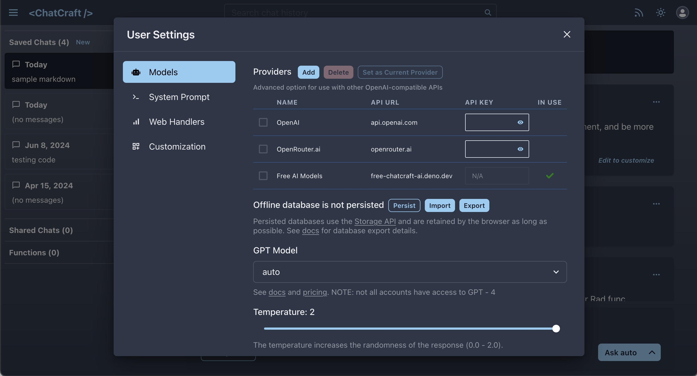
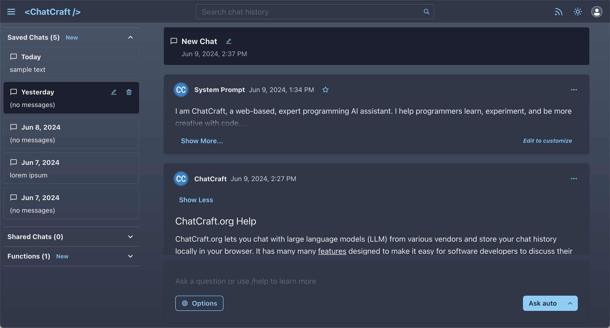
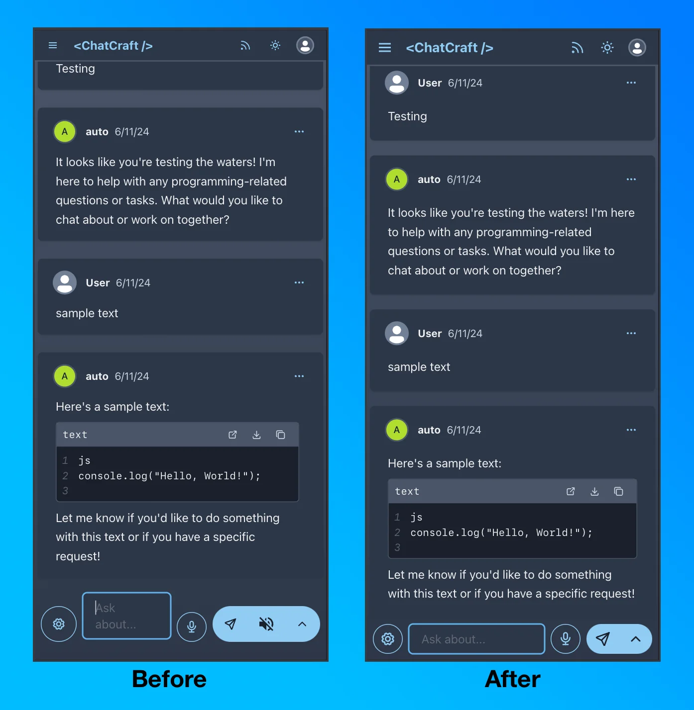

Earlier this year I discovered [Chatcraft.org](https://chatcraft.org), an AI chat app built with React specifically designed for developers to work with code, experiment, and learn using large language models (LLM). Chatcraft supports basic free LLMs but also lets you add an API key to use more advanced models like GPT-4o from OpenAI.

In this blog post I talk about:

- My fist few enhancements to Chatcraft
- Various UI fixes
- Improvements to the mobile Chatcraft experience

To learn more about Chatcraft you can read some great blog posts from [David Humphrey](https://blog.humphd.org/chatcraft-org/) and [Taras Glek](https://taras.glek.net/post/chatcraft.org-opensourcechatgpt-for-devs/).

## Initial contributions

My first contribution to Chatcraft was a [one line fix](https://github.com/tarasglek/chatcraft.org/pull/571) of a bug I found while using the app in Safari. I then picked up an [issue](https://github.com/tarasglek/chatcraft.org/issues/578) about reworking the settings panel. I created a side panel with different categories on the left and the content on the right. This is what it currently looks like:



While working on this [pull request](https://github.com/tarasglek/chatcraft.org/pull/592), I familiarized myself with [Chakra UI](https://chakra-ui.com), a React library full of great looking and accessible components to use and modify as needed.

## Recent changes

In the last few weeks, two of my pull request were accepted and merged in. The [first](https://github.com/tarasglek/chatcraft.org/pull/653) was a series of layout changes for better visual consistency throughout the app and the [second](https://github.com/tarasglek/chatcraft.org/pull/654) was focused on a better mobile experience.

### Polishing the UI

One day I was tweaking the Chatcraft UI starting with some padding and margin changes. It then led me to making more small fixes that, when put together, amounted to a substantial visual change.

I moved the search icon button inside of the search bar by using [InputRightElement](https://v2.chakra-ui.com/docs/components/input/usage#add-elements-inside-input) from Chakra UI. I made some improvements to the “starred prompt” list and it’s related icons and I changed the side bar to open to “saved chats” by defaults.

I also modified how the date is displayed in the side bar by adding “Today” and “Yesterday” options.

```js
const formattedDate = new Intl.DateTimeFormat(undefined, {
  year: "numeric",
  month: "short",
  day: "numeric",
}).format(chat.date);

const todayDate = new Date();

const currentMonth =
  todayDate.getFullYear() === chat.date.getFullYear() &&
  todayDate.getMonth() === chat.date.getMonth();

const isToday = currentMonth && todayDate.getDate() === chat.date.getDate();
const isYesterday = currentMonth && todayDate.getDate() - 1 === chat.date.getDate();
```

I used [ternary](https://developer.mozilla.org/en-US/docs/Web/JavaScript/Reference/Operators/Conditional_operator) operators to handle the logic in the react component like this:

```diff lang="js"
  <Text flex={1} fontSize="sm" as="strong">
-   {formatDate(chat.date, true)}
+   {isToday ? "Today" : isYesterday ? "Yesterday" : formattedDate}
  </Text>
```

Here is how the interface looks like now:



Overall, I feel like every element of the UI has more breathing room without losing important space for the main chat. The header, including the main title and search bar, are also more prominent.

### Focus on mobile

When we work on a project that is designed for desktop first, it is very hard to make various buttons fit into tiny screens of mobile devices without compromising usability.

As more features were added over time, more buttons started showing around the main text box area. For example, when using OpenAI models, there’s a microphone button to record text instead of typing into the prompt and there’s a “text-to-speech” to hear the AI response out loud.

After making every button the same size, I decided to move the “text-to-Speech” button inside of the right menu button (the up arrow next to the Send button) to make space for the text area. I also made a change to hide the microphone button as soon as the user starts typing. This subtle change creates a lot more space for the text area to see what is being typed on.



I wasn’t sure how the Chatcraft maintainers would react after receiving a pull request that modifies the look of the app (with quite a few opinionated changes). After all, I am not a designer and what looks good to me might not look good to someone else.

Both David and Taras have been very supportive and encouraging of my work and I’ve had great interactions with everyone involved in the project.

Chatcraft is a fantastic Open Source project for anyone looking to work on a React app!
