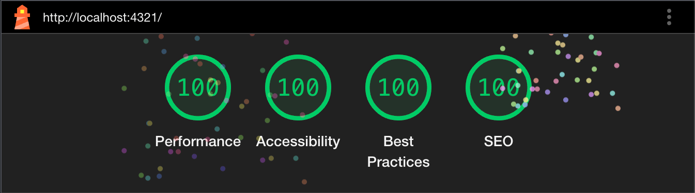
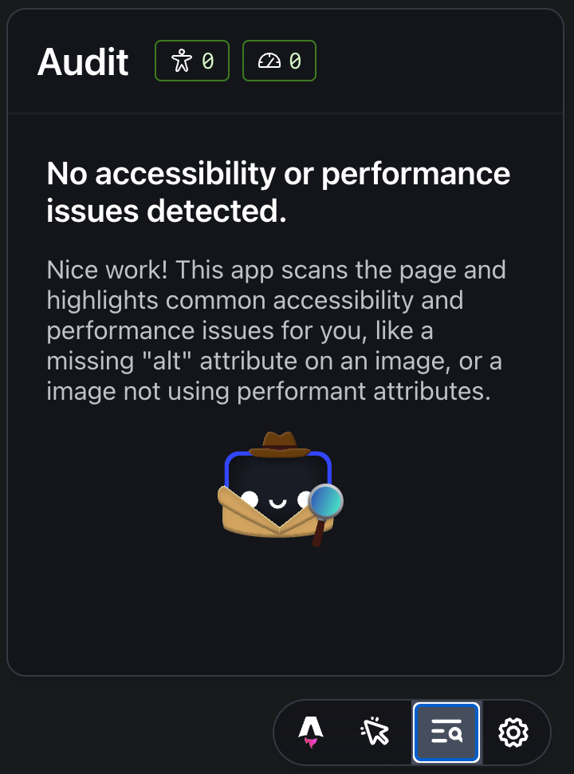

Hi, my name is Francesco and welcome to my new personal blog! I will use this space going forward to post about my learnings as a developer and things that I find interesting. You can learn more about me [here](/about).

When I was in school, I blogged using the [DEV](https://dev.to/menghif) platform. It was a great way to get started quickly as I needed a way to write about my school projects without worrying about the actual blogging platform. Since then, I tinkered with the idea of building a new personal website with a blog, but I never did until now.

When building a new blog, it’s hard to decide when you are actually “done” as you often feel like something could be improved or a new feature could be added. I decided to publish this website now and make further improvements as I go. If I were a one person startup, this would be my minimum viable product ([MVP](https://en.wikipedia.org/wiki/Minimum_viable_product)).

Let's look at how I built this website.

## Building with Astro

I've been following the [Astro](https://astro.build) project for a while and when it came time to build my own website, I knew I wanted to use it. Astro is a fantastic framework for building static sites, and it includes everything needed out of the box. For example, it comes with [Vite](https://vitejs.dev) which is a frontend tool that provides a fast server for development.

Some things I really like about Astro:

- It has great documentation and a fantastic tutorial for anyone that is starting out.
- I can simply write a new post using Markdown, and it will automatically create HTML pages for each post.
- I can divide my code into components that I can reuse across my website, and it allows me to organize my codebase in a straightforward way.
- It provides support for frontend frameworks in an Island architecture. For example, if I ever need to use React for an interactive UI, I can add it to part of my website.

The Astro template syntax is very interesting. It has a lot of the same [JSX](https://react.dev/learn/writing-markup-with-jsx) functionality as React, but it’s also easy to pick up for non-react developers since it’s just a superset of HTML. Having used JSX extensively before, I felt right at home.

An Astro component comes with a `.astro` file extension and this is what a basic component that returns a `div` looks like:

```astro
---
const name = "Francesco";
---

<div>
  <h1>Hello {name}!</h1>
</div>

<style>
  h1 {
    font-size: 2rem;
  }
</style>
```

Anything inside the `---` notation (similar to _frontmatter_ in Markdown files) is JavaScript that gets executed during the build process. This allows you to modify the page at build time without sending any JavaScript to the browser. Additionally, you can include JavaScript to run in the browser by using a `<script> </script>` tag within the same Astro file.

## Some tools I used

I wanted my website to be extremely fast and properly accessible. The theme of accessibility on the web is something that I have been reading a lot about recently and I wanted to start this website on solid foundations.

I used two different tools to make sure the basics of good web accessibility and performance are met.

### Lighthouse

The first one is probably well known by most web developers, it is Google [Lighthouse](https://developer.chrome.com/docs/lighthouse/overview).

Lighthouse lets you test your website to find many potential issues related to Performance, Accessibility, Best Practices and others. It is accessible from the Chrome Developer Tools.

After you run a test, you get a total score and a list of issues. The issues usually come with links with the relevant documentation. I find this to be a really great tool, and I’ve been using it for many years.

These are my Lighthouse results:



### Astro Dev Toolbar

This second tool is specific to Astro and came out last year with the introduction of the [4.0](https://astro.build/blog/astro-4/#the-astro-dev-toolbar) release. When you run a dev server, a little toolbar shows up at the bottom with some tools (extendible with third party integrations!) including one to help with Performance and Accessibility.



## What's next

Of course, this website will probably always be a work in progress as I continue my journey as a software developer. I plan to make improvements as I go and maybe write blog posts about the different changes I make.

I also have some web development projects that I want to pick back up and improve.

Thanks for reading!
